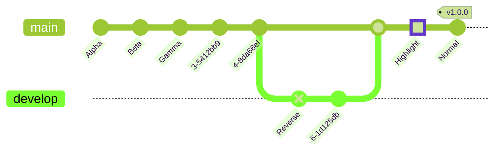

<br>

# よく使うグラフ

---

<br>
<br>
<br>

---

<!-- code_chunk_output -->

-   [よく使うグラフ](#よく使うグラフ)
    -   [折れ線グラフ](#折れ線グラフ)
    -   [棒グラフ](#棒グラフ)
    -   [円グラフ](#円グラフ)
    -   [ヒストグラム](#ヒストグラム)
    -   [レーダーチャート](#レーダーチャート)
    -   [散布図](#散布図)
    -   [パレート図](#パレート図)
    -   [クラス図 (mermaid 使用)](#クラス図-mermaid-使用)
    -   [シーケンス図 (mermaid 使用)](#シーケンス図-mermaid-使用)
    -   [フローチャート (mermaid 使用)](#フローチャート-mermaid-使用)
    -   [樹枝図 (mermaid 使用)](#樹枝図-mermaid-使用)
    -   [状態遷移図](#状態遷移図)
    -   [箱ひげ図](#箱ひげ図)
    -   [等値線図](#等値線図)
    -   [アローダイアグラム](#アローダイアグラム)
    -   [サイクル図](#サイクル図)
    -   [流線図](#流線図)
    -   [クラス図](#クラス図)
    -   [ER 図](#er-図)

<!-- /code_chunk_output -->

> matplotlib、mermaid、gnuplot など。(gnuplot はインストールしてない。)

<br>
<br>
<br>
<br>

---

---

## 折れ線グラフ

```python {cmd matplotlib}
import numpy as np
import matplotlib.pyplot as plt

x = np.arange(5)
y = x**2

plt.plot(x, y)
plt.show()
```

## 棒グラフ

```python {cmd matplotlib}
import numpy as np
import matplotlib.pyplot as plt

x = np.arange(3)
y = np.array([100, 30, 70])
plt.bar(x, y)
plt.show()
```

---

## 円グラフ

```python {cmd matplotlib}
import numpy as np
import matplotlib.pyplot as plt

x = np.array([12, 23, 100])
str_label = ['a', 'b', 'c']
plt.pie(x, labels=str_label, counterclock=False, startangle=90)
plt.show()
```


---

## ヒストグラム

```python {cmd matplotlib}
import numpy as np
import matplotlib.pyplot as plt

x = np.random.normal(50, 10, 100)
plt.hist(x)
plt.show()
```

---

## レーダーチャート

```python {cmd matplotlib}
import numpy as np
import matplotlib.pyplot as plt

labels = ['a', 'b', 'c', 'd']
values = [10, 20, 30, 40]
angles = np.linspace(0, 2*np.pi, len(labels) + 1, endpoint=True)
values = np.concatenate((values, [values[0]]))

fig = plt.figure()
ax = fig.add_subplot(111, polar=True)
ax.plot(angles, values, 'o-')
ax.fill(angles, values, alpha=0.25)
ax.set_thetagrids(angles[:-1] * 180 / np.pi, labels)
plt.show()
```

---

## 散布図

```python {cmd matplotlib}
import numpy as np
import matplotlib.pyplot as plt

x = np.random.rand(10)
y = np.random.rand(10)
plt.scatter(x, y)
plt.show()
```

---

## パレート図

```python {cmd matplotlib}
import numpy as np
import matplotlib.pyplot as plt

x = np.arange(4)
y1 = np.array([10, 5, 3, 2])
sum_y1 = np.sum(y1)
y2 = np.cumsum(y1) / sum_y1

fig = plt.figure()
ax1 = fig.add_subplot(111)
ax2 = ax1.twinx()

ax1.bar(x, y1)
ax2.plot(x, y2, c='r')
plt.show()
```

---

## クラス図 (mermaid 使用)


---

## シーケンス図 (mermaid 使用)


---

## フローチャート (mermaid 使用)


---

##　ガントチャート (mermaid 使用)


---

## 樹枝図 (mermaid 使用)


---

## 状態遷移図


---

## 箱ひげ図

```python {cmd matplotlib}
import numpy as np
import matplotlib.pyplot as plt

spread = np.random.rand(50) * 100
center = np.ones(25) * 50
flier_high = np.random.rand(10) * 100 + 100
flier_low = np.random.rand(10) * -100
data = np.concatenate((spread, center, flier_high, flier_low))

plt.boxplot(data)
plt.show()
```

---

## 等値線図

```python {cmd matplotlib}
import numpy as np
import matplotlib.pyplot as plt

delta = 0.025
x = np.arange(-3.0, 3.0, delta)
y = np.arange(-2.0, 2.0, delta)
X, Y = np.meshgrid(x, y)
Z1 = np.exp(-X**2 - Y**2)
Z2 = np.exp(-(X - 1)**2 - (Y - 1)**2)
Z = (Z1 - Z2) * 2

plt.contour(X, Y, Z)
plt.show()
```

---

## アローダイアグラム


---

## サイクル図


---

## 流線図

```python {cmd matplotlib}
import numpy as np
import matplotlib.pyplot as plt

X = [1, 3]
Y = [2, 4]
U = [5, 60]
V = [70, 8]
plt.quiver(X, Y, U, V)
plt.show()
```

---

## クラス図


| Type  |  Description  |
| :---: | :-----------: |
|  <--  |  Inheritance  |
| \*--  |  Composition  |
|  o--  |  Aggregation  |
|  -->  |  Association  |
|  --   | Link (Solid)  |
|  ..>  |  Dependency   |
| ..\|> |  Realization  |
|  ..   | Link (Dashed) |

## ER 図


| Value (left) | Value (right) |            Meaning            |
| :----------: | :-----------: | :---------------------------: |
|     \|o      |      o\|      |          Zero or one          |
|     \|\|     |     \|\|      |          Exactly one          |
|      }o      |      o{       | Zero or more (no upper limit) |
|     }\|      |      \|{      | One or more (no upper limit)  |




