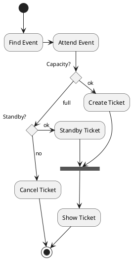

# Markdown

---

- [Markdown](#markdown)
  - [Markdown とは？](#markdown-とは)
    - [引用](#引用)
    - [リンク](#リンク)
    - [Image](#image)
    - [強調/装飾](#強調装飾)
    - [テーブル](#テーブル)
    - [二段組](#二段組)
      - [LEFT](#left)
      - [RIGHT](#right)
    - [プログラムを記述する場合](#プログラムを記述する場合)
    - [図](#図)
  - [PlantUML](#plantuml)

<!-- /code_chunk_output -->

---

## Markdown とは？

### 引用

> &emsp;Markdown（マークダウン）は、文書を記述するための軽量マークアップ言語のひとつである。
> 本来はプレーンテキスト形式で手軽に書いた文書から HTML を生成するために開発されたものである。  
> しかし、現在では HTML のほかパワーポイント形式や LATEX 形式のファイルへ変換する
> ソフトウェア（コンバータ）も開発されている。
>
> > 各コンバータの開発者によって多様な拡張が施されるため、各種の方言が存在する。

### リンク

[Wiki:Markdown](https://ja.wikipedia.org/wiki/Markdown):Wiki の Markdown のページ

<!-- html出力時に別タブで開く -->

<a href="https://qiita.com/kamihork/items/49e2a363da7d840a4149" target="_blank">Apache と Nginx について比較</a>

https://katex.org/docs/supported.html

### Image


@import "Lorenz_in_arabia.svg" {width="300px" height="200px" title="my title" alt="my alt"}

### 強調/装飾

<br>
<br>

_ここが em タグで強調されます_
_ここが em タグで強調されます_  
**ここが strong タグで強調されます**  
_ここが strong タグで強調されます_

---

-   箇条書き 1
-   箇条書き 2
    -   箇条書き 3
    -   箇条書き 4
        -   箇条書き 5
        -   箇条書き 6
-   箇条書き 7
    -   箇条書き 8

1. 数字付き 1  
   インデント
2. 数字付き 2
3. 数字付き 3

<span style="font-size:200%">

$f(x)=sin(x)$

</span>

$$\int_{-\infty}^\infty e^{-x^2} = \sqrt{\pi}$$

~~打ち消し線 line-through~~

**<font color="red">赤太字のテスト</font>**
**<font color="blue">青太字のテスト</font>**
**<font color="green">緑太字のテスト</font>**

<details><summary>サンプルコード</summary><div>

```rb
puts 'Hello, World'
```

</div></details>

<dl>
  <dt>リンゴ</dt>
  <dd>赤いフルーツ</dd>
  <dt>オレンジ</dt>
  <dd>橙色のフルーツ</dd>
</dl

-   [x] タスク 1
-   [x] タスク 2

<!-- PDF出力時の改ページ -->
<div style="page-break-before:always"></div>

\:kissing_closed_eyes: chu☆

<div style="text-align: center;">

`テキストをセンタリング`

</div>

<div align= "center">

`図とかをセンタリング`
|||
|:--:|:--:|
|pdf だと|センタリング|

</div>

### テーブル

| Left align | Right align | Center align |
| :--------- | ----------: | :----------: |
| This       |        This |     This     |
| column     |      column |    column    |
| will       |        will |     will     |
| be         |          be |      be      |
| left       |       right |    center    |
| aligned    |     aligned |   aligned    |

colspan `>` or `empty cell`:
| a | b | a | b |
| --- | --- | --- | --- |
| > | 1 | 1 | 2 |
| 2 |1| ^ | 4 |

rowspan `^`:

<table>
   <tr><th>先頭行</th><td>A1</td><td>B1</td><td>C1</td></tr>
   <tr><th>2行目</th><td>A2</td><td>B2</td><td>C2</td></tr>
   <tr><th>3行目</th><td>A3</td><td>B3</td><td>C3</td></tr>
</table>

### 二段組

<div class="block_all">
<div class="block_left">

#### LEFT

</div>

<div class="block_right">

#### RIGHT

</div>
</div>

<style>
.block_all{
    width:800px;
        margin:0 auto;
}
</style>
<style>
.block_left{
    width:390px;
        float:left;
}
</style>
<style>
.block_right{
    width:390px;
        float:right;
}
</style>

### プログラムを記述する場合

```rb{.line-numbers}
num = 0
while num < 2 do
   print("num = ", num)
end
print("End")
```

```bash {cmd=true}
echo Hello World
```

```python {cmd matplotlib}
import matplotlib.pyplot as plt
import numpy as np
x = np.arange(-10, 10, 0.01)
y_sin = np.sin(x)
y_cos = np.cos(x)
plt.plot(x, y_sin)
plt.plot(x, y_cos)
plt.show()      ###セキュリティ面からCode Chunkは無効の方がいい
###開発環境の切り替え不可？？システムのPythonを使ってるぽい
```

```python{cmd=true hide=true}
print("Hello, The World")
```

### 図


@import "Output(0).dat"

```mermaid
gantt
#dateFormat  YYYY-MM-DD
axisFormat  %m/%d
title My schedule

section AA
WORK1:active,des1, 2020-10-01,2020-10-31
WORK2:active,des2, 2020-10-01,2020-10-31

section BB
RESULT:crit,dev1, 2020-10-15,2020-11-30
WORK3:dev2,after dev1,2020-12-31
WORK4:dev3, after dev1, 2021-2-20

section CC
VACATION:test1, after dev2, 2021-3-31
WORK5:test2,after dev3, 2021-3-31

```

$f(x) = x^2 + 1$ //インライン表示
$$f(x) = x^2 + 1$$ //ブロック表示

## PlantUML


