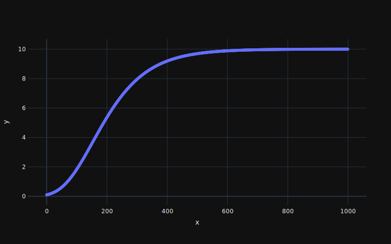
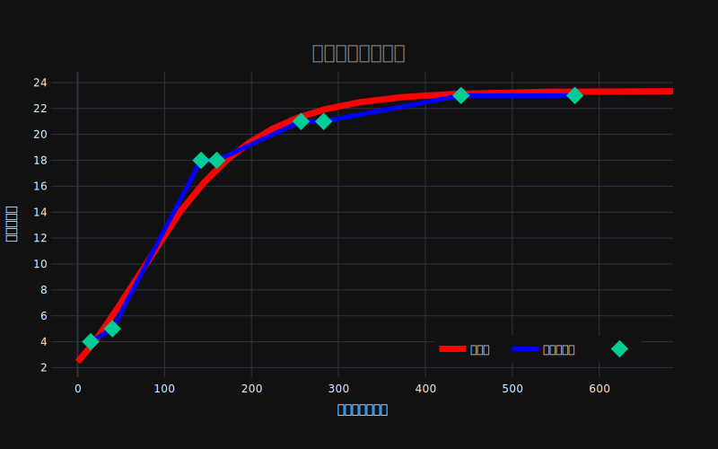

---
puppeteer:
    displayHeaderFooter: true
    headerTemplate: '<div style="font-size: 12px; margin-left: 1cm;"></div>'
    footerTemplate: '<div style="font-size: 12px; margin-left: 19cm;"><span class="pageNumber"></span>/<span class="totalPages"></span></div>'
---

# Gompertz 曲線を使った累積バグ数推定 <!-- omit in toc -->

---

<!-- code_chunk_output -->

- [1. 概要](#1-概要)
- [2. 数式](#2-数式)
  - [2.1. Gompertz 曲線](#21-gompertz-曲線)
  - [2.2. 線形変換](#22-線形変換)
  - [2.3. 正規方程式](#23-正規方程式)
- [3. プログラム](#3-プログラム)
  - [3.1. Gompertz 方程式](#31-gompertz-方程式)
  - [3.2. 正規方程式](#32-正規方程式)
  - [3.3. fit 関数](#33-fit-関数)
  - [3.4. データ](#34-データ)
  - [3.5. main](#35-main)
- [4. 結果](#4-結果)
- [5. コード](#5-コード)
- [6. 改善点](#6-改善点)

<!-- /code_chunk_output -->

---

<div style="page-break-before:always"></div>

## 1. 概要

&emsp;累積バグ数は Gompertz 曲線によく近似される。そこで実際の累積バグ数の時間推移データに最もよくあてはまる Gompertz 曲線のパラメータを重回帰分析で推定し、残存バグ数を予測する。

## 2. 数式

### 2.1. Gompertz 曲線

&emsp;初期段階では指数関数的に増加し、その後成長率が減少する。最終的にある一定の値($k$)に収束する。テスト初期にはバグが発見され修正されていくが、テスト回数に応じて次第にシステムに潜むバグが減っていき、テスト当たりにバグを引く確率が下がっていく。

$$
y=kb^{exp(-cx)}
$$

<div align=center>

`k=10`


</div>

Gompertz 方程式は非線形方程式なので線形に変換する。

### 2.2. 線形変換

両辺に自然対数をとる。

$$
\ln{y}=\ln{k}+\exp{(-cx)}\ln{b}
$$

ここで$\exp{(-cx)}$は非線形なので逐次的に近似する手法をとる。
パラメータ$c$の初期近似値を$c^{\prime}$としてその誤差を$\delta$とすると、

$$
\begin{align}
\exp{(-cx)}&\fallingdotseq\exp{(-(c^{\prime}+\delta)x)}=\exp{(-c^{\prime}x)}\exp{(-\delta x)} \\
&\fallingdotseq\exp{(-c^{\prime}x)}(1-\delta x)
\end{align}
$$

$(2)$ではマクローリン展開を使って一次の項までで近似した。

$$
\begin{align}
\nonumber\exp{(-\delta x)}&\fallingdotseq1+(-\delta x)+\frac{(-\delta x)^2}{2!}+\frac{(-\delta x)^3}{3!}+\cdot\cdot\cdot
\end{align}
$$

$(2)$式から

$$
\begin{align}
\ln{y}&=\ln{k}+\exp{(-cx)}\ln{b} \\
&=\ln{k}+\exp{(-c^{\prime}x)}(1-\delta x)\ln{b} \\
&=\ln{k}+\exp{(-c^{\prime}x)}\ln{b}-\delta x\exp{(-c^{\prime}x)}\ln{b} \\
\end{align}
$$

従って以下の重回帰式が得られる。

$$
Y=\alpha+\beta X_1+\gamma X_2
$$

$$
\begin{align}
\nonumber Y&=\ln{y} \\
\nonumber \alpha&=\ln{k} \\
\nonumber \beta&=\ln{b} \\
\nonumber X_1&=\exp{(-c^{\prime}x)} \\
\nonumber X_2&=x\exp{(-c^{\prime}x)} \\
\nonumber \gamma&=-\delta \beta \\
\end{align}
$$

$c$の近似誤差$\delta=-\gamma/\beta$が十分小さくなるまで重回帰式を繰り返し計算する。$c$は以下の差分方程式で近似値を更新する。

$$
c_{t+1}=c_t+\delta
$$

<div style="page-break-before:always"></div>

### 2.3. 正規方程式

最小二乗法

$$
L(\theta)=\text{MSE}=\frac{1}{n}\sum_{i=1}^{n}(y_i-\^{y}_i)^2 \\
\begin{align}
\nonumber y_i&:真値 \\
\nonumber \^{y}_i&:予測値
\end{align}
$$

以下の重回帰式で予測する。

$$
\bm{y}=\bm{XW+\epsilon} \\
\begin{align}
\nonumber\bm{y}&=\begin{pmatrix}
    \^{y}_1 \\
    \^{y}_2 \\
    \vdots \\
    \^{y}_i \\
\end{pmatrix} \\
\nonumber\bm{X}&=\begin{pmatrix}
    1 & X_{10} & X_{20} \\
    1 & X_{11} & X_{21} \\
    \vdots \\
    1 & X_{1i} & X_{2i} \\
\end{pmatrix} \\
\nonumber\bm{W}&=\begin{pmatrix}
    \theta_1=\alpha \\
    \theta_2=\beta \\
    \theta_3=\gamma \\
\end{pmatrix} \\
\nonumber\bm{\epsilon}&:誤差項 \\
\end{align}
$$

誤差関数は以下のようになる。

$$
\begin{align}
L(\theta)&=\frac{1}{n}\sum_{i=1}^{n}(y_i-\^{y}_i)^2 \\
&=\frac{1}{n}\bigg(\bm{(y-XW)^{\top}}\bm{(y-XW)}\bigg) \\
&=\frac{1}{n}\bigg(\bm{y^{\top}y-y^{\top}XW-W^{\top}X^{\top}y+W^{\top}X^{\top}XW}\bigg) \\
&=\frac{1}{n}\bigg(\bm{y^{\top}y-2W^{\top}X^{\top}y+W^{\top}X^{\top}XW}\bigg) \\
\end{align}
$$

両辺を$W$で偏微分する。

$$
\begin{align}
\frac{\partial{L(\theta)}}{\partial{W}}&=\frac{1}{n}\frac{\partial}{\partial{W}}\bigg(\bm{y^{\top}y-2W^{\top}X^{\top}y+W^{\top}X^{\top}XW}\bigg) \\
&=\frac{1}{n}\bigg(\bm{-2X^{\top}y+2X^{\top}XW}\bigg) \\
\end{align}
$$

$\frac{\partial{L(\theta)}}{\partial{W}}=0$のとき、$L(\theta)$は最小になるので以下のように正規方程式を導ける。

$$
\frac{\partial{L(\theta)}}{\partial{W}}=\frac{1}{n}\bigg(\bm{-2X^{\top}y+2X^{\top}XW}\bigg)=0
$$

$$
\begin{align}
\therefore \bm{X^{\top}XW}&=\bm{X^{\top}y} \\
\bm{W}&=\bm{(X^{\top}X)^{-1} X^{\top}y} \\
\end{align}
$$

補足

$$
\begin{align}
\nonumber(8)\because&\bm{y^{\top}XW}=\bm{(W^{\top}X^{\top}y)^\top}=\bm{W^{\top}X^{\top}y} \\
\nonumber(10)\because&\frac{\partial}{\partial{W}}\bm{W^{\top}X^{\top}y}=\bm{X^{\top}y} \\
\nonumber(10)\because&\frac{\partial}{\partial{W}}\bm{W^{\top}X^{\top}XW}=\bm{2X^{\top}XW} \\
\end{align}
$$

## 3. プログラム

### 3.1. Gompertz 方程式

```python
def gompertz(x: np.array, k=10, b=0.01, c=0.01) -> np.array:
    '''Gompertz
    '''
    return k * np.power(b, np.exp(-c * x))
```

### 3.2. 正規方程式

```python
def normal_eq(X: np.array, Y: np.array) -> np.array:
    '''正規方程式
    '''
    return np.linalg.pinv(X.T @ X) @ X.T @ Y  # 一般逆行列
```

### 3.3. fit 関数

```python
def fit(t: np.array, input_y: np.array) -> dict:
    '''
    cの設定値と実際の値には誤差がある。
    その誤差でc設定値を補正し新たな回帰モデルを作成、これを繰り返す。
    '''
    c_init = 0.02
    c = c_init
    Y_i = np.log(input_y)

    i = 0
    while True:
        t_x = np.insert(
            np.vstack([np.exp(-c * t), t * np.exp(-c * t)]).T,
            0, 1,
            axis=1
        )
        alpha, beta, gamma = normal_eq(t_x, Y_i)
        delta = -gamma / beta
        c += delta
        i += 1
        if abs(delta) < 1e-15 or i >= 100:
            break

    print(f"c初期値 : {c_init} ->  {i}回目 : {c}")
    print(f"収束予測値 : {np.round(np.power(np.e, alpha))}")

    return {
        "k": np.power(np.e, alpha),
        "b": np.power(np.e, beta),
        "c": c
    }
```

<div style="page-break-before:always"></div>

### 3.4. データ

| テスト日 | バグ発見個数 | テスト回数 |
| -------- | ------------ | ---------- |
| 1        | 4            | 15         |
| 2        | 1            | 25         |
| 3        | 13           | 102        |
| 4        | 0            | 18         |
| 5        | 3            | 97         |
| 6        | 0            | 26         |
| 7        | 2            | 158        |
| 8        | 0            | 131        |

### 3.5. main

```python
data = pd.DataFrame(
    {
        "bug": [4, 1, 13, 0, 3, 0, 2, 0],
        "test": [15, 25, 102, 18, 97, 26, 158, 131]
    }
)
display(data)
data = pd.DataFrame(
    {
        "Cumsum_bug": np.cumsum(data["bug"]),
        "Cumsum_test": np.cumsum(data["test"])
    }
)
display(data)
parameter = fit(data["Cumsum_test"], data["Cumsum_bug"])
x_arr = np.arange(0, np.round(data["Cumsum_test"].max() * 1.2))
result = gompertz(x_arr, **parameter)
```

<div style="page-break-before:always"></div>

## 4. 結果

```bash
c初期値 : 0.02 ->  23回目 : 0.012628319903561528
収束予測値 : 23.0
```



バグ総数の予測値は 23 個となった。十分収束していると言えるため、これ以上テストする必要はない。

## 5. コード

```python {.line-numbers}
# %%
import numpy as np
import pandas as pd
from IPython.display import display
import plotly.graph_objects as go
import plotly.express as px
# %%
data = pd.DataFrame(
    {
        "bug": [4, 1, 13, 0, 3, 0, 2, 0],
        "test": [15, 25, 102, 18, 97, 26, 158, 131]
    }
)
display(data)
data = pd.DataFrame(
    {
        "Cumsum_bug": np.cumsum(data["bug"]),
        "Cumsum_test": np.cumsum(data["test"])
    }
)
display(data)
# %%


def gompertz(x: np.array, k=10, b=0.01, c=0.01) -> np.array:
    '''Gompertz
    '''
    return k * np.power(b, np.exp(-c * x))


def normal_eq(X: np.array, Y: np.array) -> np.array:
    '''正規方程式
    '''
    return np.linalg.pinv(X.T @ X) @ X.T @ Y  # 一般逆行列


def fit(t: np.array, input_y: np.array) -> dict:
    '''
    cの設定値と実際の値には誤差がある。
    その誤差でc設定値を補正し新たな回帰モデルを作成、これを繰り返す。
    '''
    c_init = 0.02
    c = c_init
    Y_i = np.log(input_y)

    i = 0
    while True:
        t_x = np.insert(
            np.vstack([np.exp(-c * t), t * np.exp(-c * t)]).T,
            0, 1,
            axis=1
        )
        alpha, beta, gamma = normal_eq(t_x, Y_i)
        delta = -gamma / beta
        c += delta
        i += 1
        if abs(delta) < 1e-15 or i >= 100:
            break

    print(f"c初期値 : {c_init} ->  {i}回目 : {c}")
    print(f"収束予測値 : {np.round(np.power(np.e, alpha))}")

    return {
        "k": np.power(np.e, alpha),
        "b": np.power(np.e, beta),
        "c": c
    }


# %%
parameter = fit(data["Cumsum_test"], data["Cumsum_bug"])
x_arr = np.arange(0, np.round(data["Cumsum_test"].max() * 1.2))
result = gompertz(x_arr, **parameter)
# %%
chart = [
    go.Scatter(
        x=x_arr, y=result,
        line={"dash": "solid", "width": 7, "color": "red"},
        name="予測線"
    ),
    go.Scatter(
        x=data["Cumsum_test"], y=data["Cumsum_bug"],
        line={"dash": "solid", "width": 5, "color": "blue"},
        name="テスト結果"
    ),
    go.Scatter(
        x=data["Cumsum_test"], y=data["Cumsum_bug"],
        mode="markers", marker={"size": 15, "symbol": "diamond"},
        name="",
    )
]
fig = go.Figure(chart)
fig.update_layout(
    title={
        "text": "<b>累積バグ数の予測</b>",
        "font": {
            "size": 22,
            "color": "grey"
        },
        "x": 0.5,
        "y": 0.9,
    },
    legend={
        "xanchor": "right",
        "yanchor": "bottom",
        "x": 0.95,
        "y": 0.05,
        "orientation": "h"
    },
    xaxis={
        "title": "テスト実施総数",
        "dtick": 100
    },
    yaxis={
        "title": "累積バグ数",
        "dtick": 2
    }
)
fig.update_layout(
    template="plotly_dark",
    autosize=False,
    width=800,
    height=500,
    margin={
        "l": 50,
        "r": 50,
        "t": 80,
        "b": 80,
        "pad": 4
    },
)
fig.show()
fig.write_image("output_image.svg")
# %%
```

## 6. 改善点

-   計算が収束するかは$c$の初期値による。大きすぎても小さすぎても収束しない。
-   $c$の値によっては$\bm{X}$に$\inf$が含まれるようになるので逆行列を計算できなくなる。
-   データの粒度が低い。
