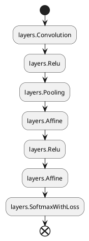
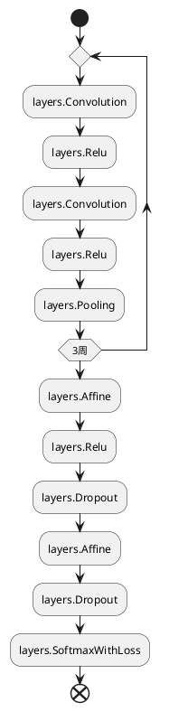

---
puppeteer:
    displayHeaderFooter: true
    headerTemplate: '<div style="font-size: 12px; margin-left: 1cm;"></div>'
    footerTemplate: '<div style="font-size: 12px; margin-left: 19cm;"><span class="pageNumber"></span>/<span class="totalPages"></span></div>'
---

# 深層学習 DAY2 レポート

---

<div style="text-align: right;">

2024 年 06 月 13 日 新規作成

</div>

---

<!-- code_chunk_output -->

- [深層学習 DAY2 レポート](#深層学習-day2-レポート)
    - [勾配消失問題](#勾配消失問題)
      - [確認テスト 1](#確認テスト-1)
      - [確認テスト 2](#確認テスト-2)
      - [確認テスト 3](#確認テスト-3)
      - [確認テスト 4](#確認テスト-4)
      - [実装演習](#実装演習)
        - [ReLU - gauss](#relu---gauss)
        - [sigmoid Xavier, He](#sigmoid-xavier-he)
        - [ReLU Xavier, He](#relu-xavier-he)
      - [考察](#考察)
    - [学習率最適化法](#学習率最適化法)
      - [確認テスト 1](#確認テスト-1-1)
      - [実装演習](#実装演習-1)
        - [sigmoid-gauss-batch\_FALSE](#sigmoid-gauss-batch_false)
        - [ReLU-He-batch\_FALSE](#relu-he-batch_false)
        - [ReLU-He-batch\_TRUE](#relu-he-batch_true)
      - [考察](#考察-1)
    - [過学習](#過学習)
      - [確認テスト 1](#確認テスト-1-2)
      - [実装演習](#実装演習-2)
        - [L1, L2](#l1-l2)
        - [Dropout](#dropout)
      - [考察](#考察-2)
    - [畳込みニューラルネットワーク](#畳込みニューラルネットワーク)
      - [確認テスト 1](#確認テスト-1-3)
      - [実装演習](#実装演習-3)
      - [考察](#考察-3)
    - [最新の CNN](#最新の-cnn)
      - [考察](#考察-4)
    - [フレームワーク演習\_正則化・最適化](#フレームワーク演習_正則化最適化)
      - [正則化](#正則化)
      - [正規化](#正規化)
      - [Dropout](#dropout-1)
      - [考察](#考察-5)

<!-- /code_chunk_output -->

---

### 勾配消失問題

&emsp;ニューラルネットワークの層が深くなると勾配降下法を用いた学習がうまく進まなくなることがある。これは、誤差逆伝搬法を使用して重みを更新する際に、層を遡るにつれて勾配が指数的に減少してくためである。結果として初期層の重みがほとんど更新されなくなり学習が停滞する。勾配消失問題の主な原因は活性化関数とその導関数の性質にある。シグモイド関数では導関数の最大値が 0.25 のため、深いニューラルネットワークではこれ以下の値を何度も掛けることにより重みの更新量がほとんど 0 になる。

対策

-   活性化関数に ReLU 関数を使用する。
    ReLU 関数の微分は$x>0$で 1 になる。
-   最適な重みの初期値を選択する。
    シグモイド関数、tanh 関数->Xavier の初期値
    ReLU 関数->He の初期値
-   BatchNorm
    ミニバッチごとに正規化することで、データの偏りをなくせる。重みの初期値にロバストになる。

#### 確認テスト 1

$dz/dx$を求める。

$$
\begin{align}
    z&=t^2 \\
    t&=x+y
\end{align}
$$

$$
\begin{align}
\nonumber\frac{dz}{dx}&=\frac{dz}{dt}\cdot\frac{dt}{dx} \\
\nonumber&=\big(2t\big)\cdot\big(1\big) \\
\nonumber&=2t
\end{align}
$$

#### 確認テスト 2

シグモイド関数の微分

$$
\begin{align}
\nonumber\frac{d \sigma(x)}{d x}&=\frac{d}{d x}\frac{1}{1+e^{-ax}}\\
\nonumber &=\frac{-1}{(1+e^{-ax})^2}\cdot-ae^{-ax} \\
\nonumber &=\frac{a}{1+e^{-ax}}\cdot\frac{1+e^{-ax}-1}{1+e^{-ax}} \\
\nonumber &=a\frac{1}{1+e^{-ax}}\cdot\big(1-\frac{1}{1+e^{-ax}}\big)
\nonumber &=a\sigma(x)(1-\sigma(x))
\end{align}
$$

$\sigma(0)=0.5$なので$a=1$のとき$\frac{d \sigma(0)}{d x}=0.25$

#### 確認テスト 3

Q:重みの初期値を 0 に設定するとどうなるか
ノードの出力が同じ値になり、誤差逆伝播法においてすべての重みが均一に更新されてしまうため。

#### 確認テスト 4

Q:バッチ正規化の効果

1. 学習の進みが早くなる
2. 初期値にそれほど依存しなくなる

#### 実装演習

##### ReLU - gauss

```python
# データの読み込み
(x_train, d_train), (x_test, d_test) = load_mnist(
    normalize=True, one_hot_label=True)

print("データ読み込み完了")

network = MultiLayerNet(
    input_size=784,
    hidden_size_list=[160, 80, 40, 20],
    output_size=10,
    activation='relu',
    weight_init_std=0.01)

iters_num = 2000
train_size = x_train.shape[0]
batch_size = 100
learning_rate = 0.1

train_loss_list = []
accuracies_train = []
accuracies_test = []

plot_interval = 10

for i in range(iters_num):
    batch_mask = np.random.choice(train_size, batch_size)
    x_batch = x_train[batch_mask]
    d_batch = d_train[batch_mask]

    # 勾配
    grad = network.gradient(x_batch, d_batch)

    for key in ('W1', 'W2', 'W3', 'b1', 'b2', 'b3'):
        network.params[key] -= learning_rate * grad[key]

    loss = network.loss(x_batch, d_batch)
    train_loss_list.append(loss)

    if (i + 1) % plot_interval == 0:
        accr_test = network.accuracy(x_test, d_test)
        accuracies_test.append(accr_test)
        accr_train = network.accuracy(x_batch, d_batch)
        accuracies_train.append(accr_train)

        print('Generation: ' + str(i + 1) +
              '. 正答率(トレーニング) = ' + str(accr_train))
        print('                : ' + str(i + 1) +
              '. 正答率(テスト) = ' + str(accr_test))


lists = range(0, iters_num, plot_interval)
plt.plot(lists, accuracies_train, label="training set")
plt.plot(lists, accuracies_test, label="test set")
plt.legend(loc="lower right")
plt.title("accuracy")
plt.xlabel("count")
plt.ylabel("accuracy")
plt.ylim(0, 1.0)
plt.show()
```

<div align=center style="width: 49.75%;float: left;">

`hidden_size_list=[40, 20]`


</div>
<div align=center style="width: 49.75%;float: right;">

`hidden_size_list=[160, 80, 40, 20]`


</div>

##### sigmoid Xavier, He

```python
network = MultiLayerNet(
    input_size=784,
    hidden_size_list=[40, 20],
    output_size=10,
    activation='sigmoid',
    weight_init_std='He'
)
```

<div align=center style="width: 49.75%;float: left;">

`Xavier`


</div>
<div align=center style="width: 49.75%;float: right;">

`He`


</div>

##### ReLU Xavier, He

```python
network = MultiLayerNet(
    input_size=784,
    hidden_size_list=[40, 20],
    output_size=10,
    activation='relu',
    weight_init_std='Xavier'
)
```

<div align=center style="width: 49.75%;float: left;">

`Xavier`


</div>
<div align=center style="width: 49.75%;float: right;">

`He`


</div>

#### 考察

&emsp;ReLU - gauss で層を深くしたときに学習が進まなくなることが確かめられた。また、重み初期値の Xavier と He の比較では ReLU に関しては大きな変化はなかったが、シグモイドのほうでは He の学習の進みが早いようだった。MNIST データはダウンロードできなかったので、`torchvision`からダウンロードした。

### 学習率最適化法

&emsp;ニューラルネットワークでは損失関数の値をできるだけ小さくしパラメータの最適化を行うことが学習の目的となっている。そのための確率的勾配降下法(SGD)であったが、SGD では学習率が大きすぎず、また小さすぎない値でないと学習がうまく進まなかった。それだけでなく、局所最適解に至らないことがある点や探索経路が非効率になる点などの欠点を改善するため以下のオプティマイザー(最適化器)が SGD の代わりに使われている。

-   **Momentum**
    ひとつ前の更新量から決まる慣性項を導入する。収束するまでの時間が早い。
    $$
    V_t\lArr\mu V_{t-1}-\epsilon\nabla E \\
    w^{t+1}\lArr w^{t}+V_t
    $$
-   **AdaGrad**
    学習が進むにつれて学習率を小さくする「学習率の減衰」を用いる。
    $$
    h_t\lArr h_{t-1}+(\nabla E)^2 \\
    w^{t+1}\lArr w^{t}-\epsilon\frac{1}{\sqrt{h_t}+\theta}\nabla E
    $$
    $\frac{1}{\sqrt{h_t}}$を乗算することで学習のスケールを小さくしてゆく。しかし、この要素は実際の最適解に到達していないにもかかわらず学習が止まってしまう鞍点問題を引き起こす。
-   **RMSProp**
    鞍点問題を改善する手法。過去の勾配を徐々に忘れて新しい勾配の情報が大きく反映されるように加算する。
    $$
    h_t\lArr \alpha h_{t-1}+(1-\alpha)(\nabla E)^2 \\
    w^{t+1}\lArr w^{t}-\epsilon\frac{1}{\sqrt{h_t}+\theta}\nabla E
    $$
-   **Adam**
    Momentum と AdaGrad の融合
    $$
    m_{t,k}=\beta_1m_{t-1,k}+(1-\beta_1)g_{t,k} \\
    v_{t,k}=\beta_2v_{t-1,k}+(1-\beta_2)g_{t,k}^2 \\
    \hat{m}_{t,k}=\frac{m_{t,k}}{1-\beta_1^k} \\
    \hat{v}_{t,k}=\frac{v_{t,k}}{1-\beta_2^k} \\
    \nabla w_{t,k}=-\frac{\alpha}{\sqrt{\hat{v_{t,k}}}+\epsilon}\hat{m_{t,k}}
    $$

#### 確認テスト 1

Q:Momentum, AdaGrad, RMSProp の特徴
Momentum:過去の勾配の指数関数的減衰平均
AdaGrad:過去の勾配の 2 乗の指数関数的減衰平均
RMSProp:鞍点問題の改善

#### 実装演習

```python
# Momentum
# データの読み込み
(x_train, d_train), (x_test, d_test) = load_mnist(
    normalize=True, one_hot_label=True)

print("データ読み込み完了")

# batch_normalizationの設定 =======================
use_batchnorm = True
# use_batchnorm = False
# ====================================================

network = MultiLayerNet(
    input_size=784,
    hidden_size_list=[
        40,
        20],
    output_size=10,
    activation='relu',
    weight_init_std="He",
    use_batchnorm=use_batchnorm)

iters_num = 1000
train_size = x_train.shape[0]
batch_size = 100
learning_rate = 0.3
# 慣性
momentum = 0.9

train_loss_list = []
accuracies_train = []
accuracies_test = []

plot_interval = 10

for i in range(iters_num):
    batch_mask = np.random.choice(train_size, batch_size)
    x_batch = x_train[batch_mask]
    d_batch = d_train[batch_mask]

    # 勾配
    grad = network.gradient(x_batch, d_batch)
    if i == 0:
        v = {}
    for key in ('W1', 'W2', 'W3', 'b1', 'b2', 'b3'):
        if i == 0:
            v[key] = np.zeros_like(network.params[key])
        v[key] = momentum * v[key] - learning_rate * grad[key]
        network.params[key] += v[key]

        loss = network.loss(x_batch, d_batch)
        train_loss_list.append(loss)

    if (i + 1) % plot_interval == 0:
        accr_test = network.accuracy(x_test, d_test)
        accuracies_test.append(accr_test)
        accr_train = network.accuracy(x_batch, d_batch)
        accuracies_train.append(accr_train)

        print('Generation: ' + str(i + 1) +
              '. 正答率(トレーニング) = ' + str(accr_train))
        print('                : ' + str(i + 1) +
              '. 正答率(テスト) = ' + str(accr_test))


lists = range(0, iters_num, plot_interval)
plt.plot(lists, accuracies_train, label="training set")
plt.plot(lists, accuracies_test, label="test set")
plt.legend(loc="lower right")
plt.title("accuracy")
plt.xlabel("count")
plt.ylabel("accuracy")
plt.ylim(0, 1.0)
plt.show()
```

##### sigmoid-gauss-batch_FALSE

<div align=center style="width: 49.75%;float: left;">

`Momentum`


</div>
<div align=center style="width: 49.75%;float: right;">

`AdaGrad`


</div>
<div align=center style="width: 49.75%;float: left;">

`RMSProp`


</div>
<div align=center style="width: 49.75%;float: right;">

`Adam`


</div>

##### ReLU-He-batch_FALSE

<div align=center style="width: 49.75%;float: left;">

`Momentum`


</div>
<div align=center style="width: 49.75%;float: right;">

`AdaGrad`


</div>
<div align=center style="width: 49.75%;float: left;">

`RMSProp`


</div>
<div align=center style="width: 49.75%;float: right;">

`Adam`


</div>

##### ReLU-He-batch_TRUE

<div align=center style="width: 49.75%;float: left;">

`Momentum`


</div>
<div align=center style="width: 49.75%;float: right;">

`AdaGrad`


</div>
<div align=center style="width: 49.75%;float: left;">

`RMSProp`


</div>
<div align=center style="width: 49.75%;float: right;">

`Adam`


</div>

#### 考察

&emsp;各条件の実行結果を比較してみると、AdaGrad と RMSProp は学習スコアとテストスコアが乖離しているように見えることもあるので過学習が疑われる。Adam は他の最適化手法と比べて過学習もなく学習の収束が早いと思われる。スコアは Adam が一番良いように見えるが、`ReLE-He-batch_TRUE`の条件ではどの最適化手法もあまり変化がない。

### 過学習

&emsp;学習データにだけ適合してしまい、テストデータには良い性能を示さないことを過学習と言う。未知のデータにも対応できる汎化性能を得ることが学習の目的であるので、表現力が高すぎないモデルを構築する必要がある。過学習の原因は以下の二つがある。

-   パラメータを大量に持ち表現力が高いモデルであること
-   訓練データが少ないこと

過学習を抑制する手法には以下がある。

-   正則化(Weight Decay)
    誤差関数に正則化項を加える。重みが大きくなるとペナルティを課す。
-   Dropout
    ノードをランダムに消去しながら学習する手法のこと。これにより同じ入力データでも別のデータで学習しているような挙動になる。

#### 確認テスト 1

<div align=center>

</div>

#### 実装演習

```python
# overfiting
(x_train, d_train), (x_test, d_test) = load_mnist(normalize=True)

print("データ読み込み完了")

# 過学習を再現するために、学習データを削減
x_train = x_train[:300]
d_train = d_train[:300]

network = MultiLayerNet(
    input_size=784,
    hidden_size_list=[
        100,
        100,
        100,
        100,
        100,
        100],
    output_size=10)
optimizer = optimizer.SGD(learning_rate=0.01)

iters_num = 1000
train_size = x_train.shape[0]
batch_size = 100

train_loss_list = []
accuracies_train = []
accuracies_test = []

plot_interval = 10


for i in range(iters_num):
    batch_mask = np.random.choice(train_size, batch_size)
    x_batch = x_train[batch_mask]
    d_batch = d_train[batch_mask]

    grad = network.gradient(x_batch, d_batch)
    optimizer.update(network.params, grad)

    loss = network.loss(x_batch, d_batch)
    train_loss_list.append(loss)

    if (i + 1) % plot_interval == 0:
        accr_train = network.accuracy(x_train, d_train)
        accr_test = network.accuracy(x_test, d_test)
        accuracies_train.append(accr_train)
        accuracies_test.append(accr_test)

        print('Generation: ' + str(i + 1) +
              '. 正答率(トレーニング) = ' + str(accr_train))
        print('                : ' + str(i + 1) +
              '. 正答率(テスト) = ' + str(accr_test))

lists = range(0, iters_num, plot_interval)
plt.plot(lists, accuracies_train, label="training set")
plt.plot(lists, accuracies_test, label="test set")
plt.legend(loc="lower right")
plt.title("accuracy")
plt.xlabel("count")
plt.ylabel("accuracy")
plt.ylim(0, 1.0)
plt.show()
```

##### L1, L2

<div align=center style="width: 49.75%;float: left;">

`L1 weight_decay_lambda = 0.00005`


</div>
<div align=center style="width: 49.75%;float: right;">

`L2 weight_decay_lambda = 0.1`


</div>
<div align=center style="width: 49.75%;float: left;">

`L1 weight_decay_lambda = 0.0001`


</div>
<div align=center style="width: 49.75%;float: right;">

`L2 weight_decay_lambda = 0.15`


</div>
<div align=center style="width: 49.75%;float: left;">

`L1 weight_decay_lambda = 0.01`


</div>
<div align=center style="width: 49.75%;float: right;">

`L2 weight_decay_lambda = 0.2`


</div>

##### Dropout

<div align=center style="width: 49.75%;float: left;">

`dropout_ratio = 0.1 SGD`


</div>
<div align=center style="width: 49.75%;float: right;">

`dropout_ratio = 0.1 Adam`


</div>
<div align=center style="width: 49.75%;float: left;">

`dropout_ratio = 0.15 SGD`


</div>
<div align=center style="width: 49.75%;float: right;">

`dropout_ratio = 0.15 Adam`


</div>
<div align=center style="width: 49.75%;float: left;">

`dropout_ratio = 0.30 SGD`


</div>
<div align=center style="width: 49.75%;float: right;">

`dropout_ratio = 0.30 Adam`


</div>

#### 考察

&emsp;Weight Decay を大きくしすぎると学習が進まなくなりスコアが下がった。L1 正則化の方はスパース性の関係かスコアが安定していない。Dropout 率を上げると SGD の方は過学習が抑えられたがスコアが低下したのでエポック数を増やす必要があるかもしれない。一方 Adam の方は Dropout 率を上げてもスコアは変化しなかった。

### 畳込みニューラルネットワーク

&emsp;全結合層のニューラルネットワークでは、データの形状の特徴を捉えることができない。例えば、画像データなどではピクセルの連なりといった空間的情報を活かすことができないので、このような次元間で繋がりのあるデータを扱う際には CNN を用いる。CNN は畳込み層、プーリング層などの組み合わせで構成される。

-   畳込み層(Convolution)
    入力データに対しフィルターを適用し畳込み演算する。畳込み層の出力が特徴マップと呼ばれる。
-   プーリング層(pooling)
    圧縮してデータを集約する。集約手法には MaxPooling と AvgPooling がある。

#### 確認テスト 1

Q:サイズ 6x6 の入力画像をサイズ 2x2 のフィルタで畳込んだ時の出力画像のサイズ

$$
OH=\frac{H+2\times paddingH-filterH}{stride}+1 \\
OW=\frac{W+2\times paddingW-filterW}{stride}+1
$$

パディング=1, ストライド=1 で
$OH=7, OW=7$

#### 実装演習

-   im2col の挙動確認

```python
# %%
import numpy as np
from collections import OrderedDict
from DNN_code_colab_day2.common import layers, functions, optimizer
from DNN_code_colab_day2.data.mnist import load_mnist
from DNN_code_colab_day2.common.multi_layer_net import MultiLayerNet
import matplotlib.pyplot as plt
# %%
# 画像データを２次元配列に変換
'''
input_data: 入力値
filter_h: フィルターの高さ
filter_w: フィルターの横幅
stride: ストライド
pad: パディング
'''


def im2col(input_data, filter_h, filter_w, stride=1, pad=0):
    # N: number, C: channel, H: height, W: width
    N, C, H, W = input_data.shape
    # 切り捨て除算
    out_h = (H + 2 * pad - filter_h) // stride + 1
    out_w = (W + 2 * pad - filter_w) // stride + 1

    img = np.pad(
        input_data, [
            (0, 0), (0, 0), (pad, pad), (pad, pad)], 'constant')
    col = np.zeros((N, C, filter_h, filter_w, out_h, out_w))

    for y in range(filter_h):
        y_max = y + stride * out_h
        for x in range(filter_w):
            x_max = x + stride * out_w
            col[:, :, y, x, :, :] = img[:, :, y:y_max:stride, x:x_max:stride]

    # (N, C, filter_h, filter_w, out_h, out_w) -> (N, filter_w, out_h, out_w, C, filter_h)
    col = col.transpose(0, 4, 5, 1, 2, 3)

    col = col.reshape(N * out_h * out_w, -1)
    return col


# %%
# im2colの処理確認
# number, channel, height, widthを表す
input_data = np.random.rand(2, 1, 4, 4) * 100 // 1
print('========== input_data ===========\n', input_data)
print('==============================')
filter_h = 4
filter_w = 4
stride = 1
pad = 0
col = im2col(
    input_data,
    filter_h=filter_h,
    filter_w=filter_w,
    stride=stride,
    pad=pad)
print('============= col ==============\n', col)
print('==============================')
```

**結果**

```bash
========== input_data ===========
 [[[[83. 21. 93. 93.]
   [39. 46. 95. 73.]
   [29. 26. 45. 21.]
   [37. 98. 34.  1.]]]


 [[[78.  8. 88.  6.]
   [47. 60. 22. 19.]
   [46. 38. 56. 81.]
   [56. 77. 13. 33.]]]]
==============================
============= col ==============
 [[83. 21. 93. 93. 39. 46. 95. 73. 29. 26. 45. 21. 37. 98. 34.  1.]
 [78.  8. 88.  6. 47. 60. 22. 19. 46. 38. 56. 81. 56. 77. 13. 33.]]
==============================
```

フィルターサイズを(4, 4)にするとデータを平坦化することと同じになる。

-   `SimpleConvNet`と`DeepConvNet`の比較

```python
class SimpleConvNet:
    # conv - relu - pool - affine - relu - affine - softmax
    def __init__(
        self,
        input_dim=(1, 28, 28),
        conv_param={
            'filter_num': 30,
            'filter_size': 5,
            'pad': 0,
            'stride': 1
        },
        hidden_size=100,
        output_size=10,
        weight_init_std=0.01
    ):
        filter_num = conv_param['filter_num']
        filter_size = conv_param['filter_size']
        filter_pad = conv_param['pad']
        filter_stride = conv_param['stride']
        input_size = input_dim[1]
        conv_output_size = (input_size - filter_size + 2 *
                            filter_pad) / filter_stride + 1
        pool_output_size = int(
            filter_num * (conv_output_size / 2) * (conv_output_size / 2))

        # 重みの初期化
        self.params = {}
        self.params['W1'] = weight_init_std * \
            np.random.randn(filter_num, input_dim[0], filter_size, filter_size)
        self.params['b1'] = np.zeros(filter_num)
        self.params['W2'] = weight_init_std * \
            np.random.randn(pool_output_size, hidden_size)
        self.params['b2'] = np.zeros(hidden_size)
        self.params['W3'] = weight_init_std * \
            np.random.randn(hidden_size, output_size)
        self.params['b3'] = np.zeros(output_size)

        # レイヤの生成
        self.layers = OrderedDict()
        self.layers['Conv1'] = layers.Convolution(
            self.params['W1'],
            self.params['b1'],
            conv_param['stride'],
            conv_param['pad'])
        self.layers['Relu1'] = layers.Relu()
        self.layers['Pool1'] = layers.Pooling(pool_h=2, pool_w=2, stride=2)
        self.layers['Affine1'] = layers.Affine(
            self.params['W2'], self.params['b2'])
        self.layers['Relu2'] = layers.Relu()
        self.layers['Affine2'] = layers.Affine(
            self.params['W3'], self.params['b3'])

        self.last_layer = layers.SoftmaxWithLoss()

    def predict(self, x):
        for key in self.layers.keys():
            x = self.layers[key].forward(x)
        return x

    def loss(self, x, d):
        y = self.predict(x)
        return self.last_layer.forward(y, d)

    def accuracy(self, x, d, batch_size=100):
        if d.ndim != 1:
            d = np.argmax(d, axis=1)

        acc = 0.0

        for i in range(int(x.shape[0] / batch_size)):
            tx = x[i * batch_size:(i + 1) * batch_size]
            td = d[i * batch_size:(i + 1) * batch_size]
            y = self.predict(tx)
            y = np.argmax(y, axis=1)
            acc += np.sum(y == td)

        return acc / x.shape[0]

    def gradient(self, x, d):
        # forward
        self.loss(x, d)

        # backward
        dout = 1
        dout = self.last_layer.backward(dout)
        layers = list(self.layers.values())

        layers.reverse()
        for layer in layers:
            dout = layer.backward(dout)

        # 設定
        grad = {}
        grad['W1'], grad['b1'] = self.layers['Conv1'].dW, self.layers['Conv1'].db
        grad['W2'], grad['b2'] = self.layers['Affine1'].dW, self.layers['Affine1'].db
        grad['W3'], grad['b3'] = self.layers['Affine2'].dW, self.layers['Affine2'].db

        return grad
```

```python
class DeepConvNet:
    '''
    認識率99%以上の高精度なConvNet

    conv - relu - conv- relu - pool -
    conv - relu - conv- relu - pool -
    conv - relu - conv- relu - pool -
    affine - relu - dropout - affine - dropout - softmax
    '''

    def __init__(self, input_dim=(1, 28, 28),
                 conv_param_1={'filter_num': 16, 'filter_size': 3, 'pad': 1, 'stride': 1},
                 conv_param_2={'filter_num': 16, 'filter_size': 3, 'pad': 1, 'stride': 1},
                 conv_param_3={'filter_num': 32, 'filter_size': 3, 'pad': 1, 'stride': 1},
                 conv_param_4={'filter_num': 32, 'filter_size': 3, 'pad': 2, 'stride': 1},
                 conv_param_5={'filter_num': 64, 'filter_size': 3, 'pad': 1, 'stride': 1},
                 conv_param_6={'filter_num': 64, 'filter_size': 3, 'pad': 1, 'stride': 1},
                 hidden_size=50, output_size=10):
        # 重みの初期化===========
        # 各層のニューロンひとつあたりが、前層のニューロンといくつのつながりがあるか
        pre_node_nums = np.array([1 * 3 * 3,
                                  16 * 3 * 3,
                                  16 * 3 * 3,
                                  32 * 3 * 3,
                                  32 * 3 * 3,
                                  64 * 3 * 3,
                                  64 * 4 * 4,
                                  hidden_size])
        wight_init_scales = np.sqrt(2.0 / pre_node_nums)  # Heの初期値

        self.params = {}
        pre_channel_num = input_dim[0]
        for idx, conv_param in enumerate(
                [conv_param_1, conv_param_2, conv_param_3, conv_param_4, conv_param_5, conv_param_6]):
            self.params['W' + str(idx + 1)] = wight_init_scales[idx] * np.random.randn(
                conv_param['filter_num'], pre_channel_num, conv_param['filter_size'], conv_param['filter_size'])
            self.params['b' + str(idx + 1)
                        ] = np.zeros(conv_param['filter_num'])
            pre_channel_num = conv_param['filter_num']
        self.params['W7'] = wight_init_scales[6] * \
            np.random.randn(pre_node_nums[6], hidden_size)
        print(self.params['W7'].shape)
        self.params['b7'] = np.zeros(hidden_size)
        self.params['W8'] = wight_init_scales[7] * \
            np.random.randn(pre_node_nums[7], output_size)
        self.params['b8'] = np.zeros(output_size)

        # レイヤの生成===========
        self.layers = []
        self.layers.append(
            layers.Convolution(
                self.params['W1'],
                self.params['b1'],
                conv_param_1['stride'],
                conv_param_1['pad']))
        self.layers.append(layers.Relu())
        self.layers.append(
            layers.Convolution(
                self.params['W2'],
                self.params['b2'],
                conv_param_2['stride'],
                conv_param_2['pad']))
        self.layers.append(layers.Relu())
        self.layers.append(layers.Pooling(pool_h=2, pool_w=2, stride=2))
        self.layers.append(
            layers.Convolution(
                self.params['W3'],
                self.params['b3'],
                conv_param_3['stride'],
                conv_param_3['pad']))
        self.layers.append(layers.Relu())
        self.layers.append(
            layers.Convolution(
                self.params['W4'],
                self.params['b4'],
                conv_param_4['stride'],
                conv_param_4['pad']))
        self.layers.append(layers.Relu())
        self.layers.append(layers.Pooling(pool_h=2, pool_w=2, stride=2))
        self.layers.append(
            layers.Convolution(
                self.params['W5'],
                self.params['b5'],
                conv_param_5['stride'],
                conv_param_5['pad']))
        self.layers.append(layers.Relu())
        self.layers.append(
            layers.Convolution(
                self.params['W6'],
                self.params['b6'],
                conv_param_6['stride'],
                conv_param_6['pad']))
        self.layers.append(layers.Relu())
        self.layers.append(layers.Pooling(pool_h=2, pool_w=2, stride=2))
        self.layers.append(layers.Affine(self.params['W7'], self.params['b7']))
        self.layers.append(layers.Relu())
        self.layers.append(layers.Dropout(0.5))
        self.layers.append(layers.Affine(self.params['W8'], self.params['b8']))
        self.layers.append(layers.Dropout(0.5))

        self.last_layer = layers.SoftmaxWithLoss()

    def predict(self, x, train_flg=False):
        for layer in self.layers:
            if isinstance(layer, layers.Dropout):
                x = layer.forward(x, train_flg)
            else:
                x = layer.forward(x)
        return x

    def loss(self, x, d):
        y = self.predict(x, train_flg=True)
        return self.last_layer.forward(y, d)

    def accuracy(self, x, d, batch_size=100):
        if d.ndim != 1:
            d = np.argmax(d, axis=1)

        acc = 0.0

        for i in range(int(x.shape[0] / batch_size)):
            tx = x[i * batch_size:(i + 1) * batch_size]
            td = d[i * batch_size:(i + 1) * batch_size]
            y = self.predict(tx, train_flg=False)
            y = np.argmax(y, axis=1)
            acc += np.sum(y == td)

        return acc / x.shape[0]

    def gradient(self, x, d):
        # forward
        self.loss(x, d)

        # backward
        dout = 1
        dout = self.last_layer.backward(dout)

        tmp_layers = self.layers.copy()
        tmp_layers.reverse()
        for layer in tmp_layers:
            dout = layer.backward(dout)

        # 設定
        grads = {}
        for i, layer_idx in enumerate((0, 2, 5, 7, 10, 12, 15, 18)):
            grads['W' + str(i + 1)] = self.layers[layer_idx].dW
            grads['b' + str(i + 1)] = self.layers[layer_idx].db

        return grads
```

<div align=center style="width: 49.75%;float: left;">

`SimpleConvNet`



<br><br><br><br><br><br><br><br><br><br><br>

</div>
<div align=center style="width: 49.75%;float: right;">

`DeepConvNet`



</div>

実行結果

<div align=center style="width: 49.75%;float: left;">

`SimpleConvNet`


</div>
<div align=center style="width: 49.75%;float: right;">

`DeepConvNet`


</div>

#### 考察

&emsp;`SimpleConvNet`と`DeepConvNet`の違いは Dropout 層の有無と単純に層が深いかどうかにあるようだ。結果は`SimpleConvNet`は訓練データとテストデータでスコアに少し乖離があり、最終的なスコアは`DeepConvNet`の方が高い。層を深くすると共に過学習も抑制できていると考えられる。また、`DeepConvNet`の実行には 20 分ほどかかった。`Cupy`や深層学習ライブラリで GPU を使って時短したい。

### 最新の CNN

-   AlexNex
    畳込み層とプーリング層を重ねて最後に全結合層を経由して結果を出力する。
-   VGG
    畳込み層や全結合層を全部で 16 層まで重ねてディープにしている。
-   GoogleNet
    ネットワークが縦方向だけでなく横方向にも深さを持っている。
-   ResNet
    スキップ構造を導入して層を深くすることに比例して性能を向上させている。

#### 考察

&emsp;言葉としては知っていた上記のモデルについて改めて勉強してみると、今までの知識を使ってより理解できるようになっていると思います。性能を向上させるために様々な発想で工夫していることが分かりました。

### フレームワーク演習\_正則化・最適化

#### 正則化

tensorflow では`activity_regularizer`の引数に渡す。

```python
tf.keras.layers.Dense(512, activation='relu', activity_regularizer=tf.keras.regularizers.L1(0.01))
```

-   L1
    ペナルティ項として L1 ノルム（絶対値和）を使用する手法
-   L2
    ペナルティ項として L2 ノルム（二乗和）を使用する手法
-   ElasticNet
    L1 正則化と L2 正則化をある比率で組み合わせる手法

```python
import tensorflow as tf
import numpy as np

(x_train, y_train), (x_test, y_test) = tf.keras.datasets.cifar10.load_data()

x_train = x_train / 255
x_test = x_test / 255
y_train = tf.one_hot(y_train.reshape(len(y_train)), depth=10)
y_test = tf.one_hot(y_test.reshape(len(y_test)), depth=10)

print(x_train.shape)
print(y_train.shape)
print(x_test.shape)
print(y_test.shape)

def create_model(input_shape, class_num, regularization_method, regularization_method_weight=0.01):
    model = tf.keras.models.Sequential([
        tf.keras.layers.Conv2D(32, 3, padding='same', input_shape=input_shape[1:], activation='relu'),
        tf.keras.layers.Conv2D(32, 3, activation='relu'),
        tf.keras.layers.MaxPooling2D(),
        tf.keras.layers.Flatten(),
        tf.keras.layers.Dense(512, activation='relu',
                              activity_regularizer=regularization_method(regularization_method_weight)) if regularization_method else tf.keras.layers.Dense(512, activation='relu'),
        tf.keras.layers.Dense(class_num, activation='softmax'),
    ])

    model.compile(optimizer='adam', loss='categorical_crossentropy', metrics=['acc'])

    return model

epochs = 10
batch_size = 256

regularizers = [
                None,
                tf.keras.regularizers.L1,
                tf.keras.regularizers.L2,
                tf.keras.regularizers.L1L2
]

tf.random.set_seed(0) # 再現性を高めるために乱数シードを固定しています。
histories = []
for regularizer in regularizers:
    model = create_model(x_train.shape, 10, regularizer)

    history = model.fit(x_train, y_train,
                    validation_data=(x_test, y_test),
                    batch_size=batch_size, epochs=epochs)
    histories.append(history)

import pandas as pd
import seaborn as sns

fig = plt.figure(figsize=(10, 20))

for i, history in enumerate(histories):
    regularizer_name = str(regularizers[i])
    ax = fig.add_subplot(4, 1, i + 1)

    plot_df = pd.DataFrame(history.history)[['loss', 'val_loss']]
    sns.lineplot(data=plot_df, ax=ax)
    ax.set_title(regularizer_name)
```

<div align=center>

</div>

#### 正規化

tensorflow では以下のメソッドで正規化層を設定する。

```python
tf.keras.layers.BatchNormalization
tf.keras.layers.LayerNormalization
tfa.layers.InstanceNormalization
```

-   Batch 正規化
    ミニバッチごとに入力データの分布を標準化する手法
-   Layer 正規化
    サンプルの内の一つをそれぞれ標準化する手法
-   Instance 正規化
    各サンプルの各チャネルごとに標準化する手法

```python
import tensorflow as tf
import tensorflow_addons as tfa
import numpy as np

(x_train, y_train), (x_test, y_test) = tf.keras.datasets.cifar10.load_data()

x_train = x_train / 255
x_test = x_test / 255
y_train = tf.one_hot(y_train.reshape(len(y_train)), depth=10)
y_test = tf.one_hot(y_test.reshape(len(y_test)), depth=10)

print(x_train.shape)
print(y_train.shape)
print(x_test.shape)
print(y_test.shape)

def create_model(input_shape, class_num, norm_layer):
    if norm_layer:
        model = tf.keras.models.Sequential([
            tf.keras.layers.Conv2D(32, 3, padding='same', input_shape=input_shape[1:], activation='relu'),
            norm_layer(),
            tf.keras.layers.Conv2D(32, 3, activation='relu'),
            tf.keras.layers.MaxPooling2D(),
            tf.keras.layers.Flatten(),
            tf.keras.layers.Dense(512, activation='relu'),
            tf.keras.layers.Dense(class_num, activation='softmax'),
        ])
    else:
        model = tf.keras.models.Sequential([
            tf.keras.layers.Conv2D(32, 3, padding='same', input_shape=input_shape[1:], activation='relu'),
            tf.keras.layers.Conv2D(32, 3, activation='relu'),
            tf.keras.layers.MaxPooling2D(),
            tf.keras.layers.Flatten(),
            tf.keras.layers.Dense(512, activation='relu'),
            tf.keras.layers.Dense(class_num, activation='softmax'),
        ])

    model.compile(optimizer='adam', loss='categorical_crossentropy', metrics=['acc'])

    return model

epochs = 10
batch_size = 256

norm_layers = [
                None,
                tf.keras.layers.BatchNormalization,
                tf.keras.layers.LayerNormalization,
                tfa.layers.InstanceNormalization
]

tf.random.set_seed(0) # 再現性を高めるために乱数シードを固定しています。
histories = []
for norm_layer in norm_layers:
    model = create_model(x_train.shape, 10, norm_layer)

    history = model.fit(x_train, y_train,
                    validation_data=(x_test, y_test),
                    batch_size=batch_size, epochs=epochs)
    histories.append(history)

import pandas as pd
import seaborn as sns

fig = plt.figure(figsize=(10, 20))

for i, history in enumerate(histories):
    norm_layer_name = str(norm_layers[i])
    ax = fig.add_subplot(4, 1, i + 1)

    plot_df = pd.DataFrame(history.history)[['loss', 'val_loss']]
    sns.lineplot(data=plot_df, ax=ax)
    ax.set_title(norm_layer_name)
```

<div align=center>

</div>

#### Dropout

以下のようにドロップアウト層を設定する。

```python
tf.keras.layers.Dropout(dropout_rate)
```

```python
import tensorflow as tf
import numpy as np

(x_train, y_train), (x_test, y_test) = tf.keras.datasets.cifar10.load_data()

x_train = x_train / 255
x_test = x_test / 255
y_train = tf.one_hot(y_train.reshape(len(y_train)), depth=10)
y_test = tf.one_hot(y_test.reshape(len(y_test)), depth=10)

print(x_train.shape)
print(y_train.shape)
print(x_test.shape)
print(y_test.shape)

epochs = 5
batch_size = 256

def create_model(input_shape, class_num):
    model = tf.keras.models.Sequential([
        tf.keras.layers.Conv2D(32, 3, padding='same', input_shape=input_shape[1:], activation='relu'),
        tf.keras.layers.Conv2D(32, 3, activation='relu'),
        tf.keras.layers.MaxPooling2D(),
        tf.keras.layers.Flatten(),
        tf.keras.layers.Dense(512, activation='relu'),
        tf.keras.layers.Dense(class_num, activation='softmax'),
    ])

    model.compile(optimizer='adam', loss='categorical_crossentropy', metrics=['acc'])

    return model

model = create_model(x_train.shape, 10)
model.summary()
```

<div align=center>

</div>

#### 考察

&emsp;サンプルコードを実行してみて学習データとテストデータの loss の比較だけでなく、手法ごとの比較でそのデータに合った最適な手法を選択する必要があると思った。精度を高めるため様々な手法を試せるようにまずはどのような手法があるのかを理解したい。
